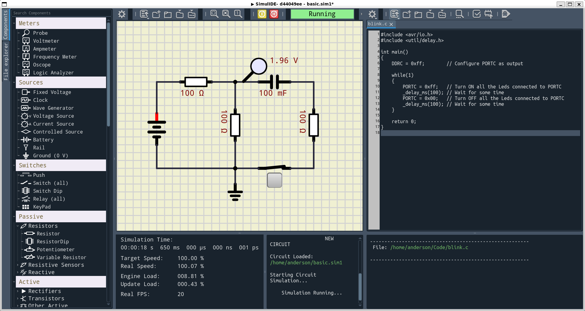

# Dark Theme for SimulIDE

A custom dark theme for SimulIDE, designed to enhance your simulation experience with a sleek, eye-friendly interface.




# Adding the Dark Theme to SimulIDE

**Attention:** Before you start, it is highly recommended to back up the files and directories that will be replaced. This precaution allows you to revert to the original state if you prefer the initial appearance or do not like the theme.

## Steps to Apply the Theme

1. **Backup Important Files:**
   - Before proceeding, ensure to backup the relevant files and directories in case you need to revert the changes.

2. **Replace Images:**
   - Copy and replace the images found in the root of this repository:
     - `components/*` to `src/icons/components/`
     - `mainwindow/*` to `src/icons/mainwindow/`

3. **Copy QDarkStyle Files:**
   - The `qdarkstyle/*` files added in this repository should be copied to the `src/qdarkstyle` directory of SimulIDE.

4. **Images:**
   - The files located in the `images` directory can be copied to your `data/images` directory in SimulIDE.

### Modifying Code Files Before Building

- **Edit SimulIDE.pri:**
  - In the root of the SimulIDE source, edit the `SimulIDE.pri` file and add the following lines:
    ```pri
    RESOURCES = $$PWD/src/application.qrc
    # Right below the last line of RESOURCES...
    RESOURCES += $$PWD/src/qdarkstyle/light/lightstyle.qrc
    RESOURCES += $$PWD/src/qdarkstyle/dark/darkstyle.qrc
    ```

- **Update mainwindow.cpp:**
  - In the `src/mainwindow.cpp` file, add the following lines below `setFont( df );` inside the main function `MainWindow::MainWindow()`:
    ```cpp
    // Look for this block:
    // Fonts --------------------------------------
    // ...rest of the code...
    setFont( df );
    //----------------------------------------------

    // Now, copy only the lines below at the end of the font routines.
    QFile f(":qdarkstyle/dark/darkstyle.qss");

    if (!f.exists()) {
        printf("Unable to set stylesheet, file not found\n");
    }
    else {
        f.open(QFile::ReadOnly | QFile::Text);
        QTextStream ts(&f);
        qApp->setStyleSheet(ts.readAll());
    }
    ```

## Building SimulIDE

- The steps for building SimulIDE can be found in the official repository of the SimulIDE creator at [https://github.com/Arcachofo/SimulIDE-dev](https://github.com/Arcachofo/SimulIDE-dev). More details are commented in the [README.md](https://github.com/Arcachofo/SimulIDE-dev/blob/master/README.md) file.


## Extra Scripts

Included in this repository is a Python script named invert_colors.py, designed to automate the process of inverting colors of images. This script can be particularly useful for adapting various assets to match the dark theme aesthetics of SimulIDE.


## Credits

- All credits for SimulIDE go to its author, Arcachofo. Visit [https://simulide.com](https://simulide.com) for more information.
- The original files for the QDarkStyle theme can be found at [https://github.com/ColinDuquesnoy/QDarkStyleSheet](https://github.com/ColinDuquesnoy/QDarkStyleSheet). Credits to its author, Colin Duquesnoy.
